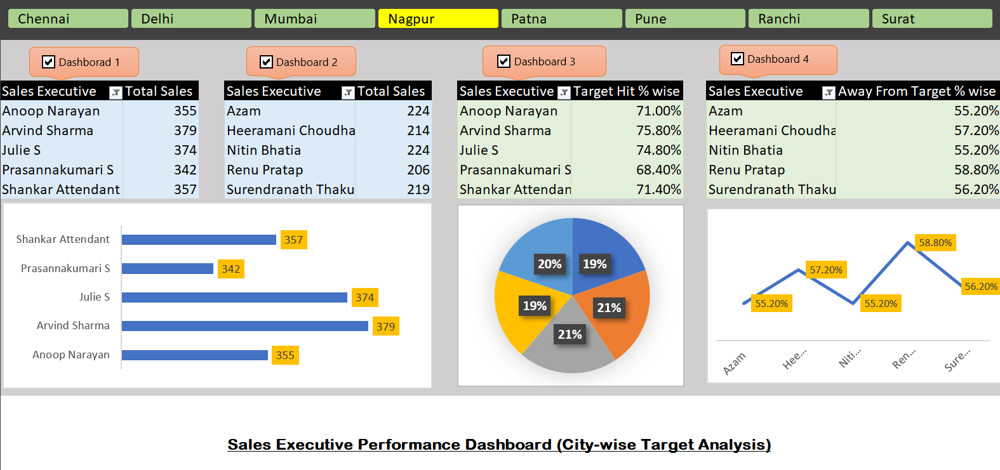

# 📊 Sales Executive Performance Dashboard (Excel)

This project is a fully Excel-based **Sales Dashboard** designed to analyze and visualize the performance of sales executives across multiple Indian cities. It includes KPI indicators, visualizations, and a clean layout for quick performance insights.

---

## 🧾 Project Overview

The dashboard helps track:
- Total sales per executive and city
- Target vs Actual performance
- KPI metrics such as:
  - 🎯 Target Hit %
  - 📉 Away From Target
  - 💰 Total Sales

All visuals and calculations were created using **Microsoft Excel** — no external tools or plugins.

---

## 🧰 Tools & Techniques Used

| Tool        | Purpose                    |
|-------------|----------------------------|
| Excel       | Data cleaning and modeling |
| Excel Charts| Visual KPIs and tracking   |
| Formulas    | SUMIF, IF, % Calculations  |
| Formatting  | Clean UI & Data grouping   |

---

## 📷 Screenshot

> *Preview of the Excel dashboard showing performance by city and executive.*

---

## 📂 Files Included

| File Name                | Description                              |
|--------------------------|------------------------------------------|
| `Sales_Dashboard.xlsx`   | Main Excel file with dashboard & data    |
| `Dashboard_Screenshot.png` | Preview of the dashboard interface     |

---

## 🧪 Key Insights
- Identifies top and low-performing sales executives
- Tracks which cities achieved their sales targets
- Offers a quick visual understanding of sales health

---

## 📌 How to Use
1. Download the `Sales_Dashboard.xlsx` file.
2. Open it in **Microsoft Excel** (desktop version recommended).
3. Explore the "Dashboard" sheet to interact with KPIs and visuals.

---

